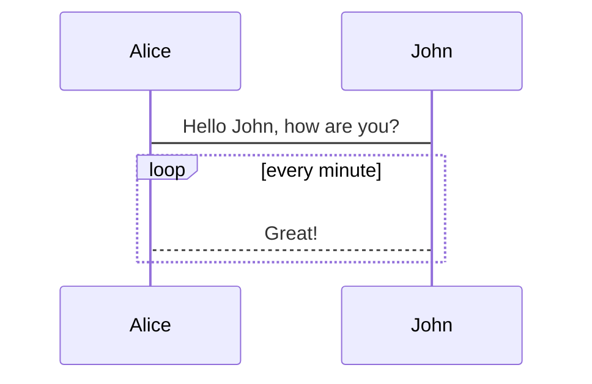

# This is README.md

Quickly setup a simple site to store markdown notes, and share them via static website.

## Usage

- Uses this template to create your own repository.
- Modify `.vuepress/config.js`, guided by comments inside.
  - Note: You **at least** should change `base`, or you will probably see a ill-rendered page. 
  - If you want to deploy it as `https://xxx.github.io/`, leave it as `base: '/'`.
  - If you want to deploy it as `https://xxx.github.io/yyy` , leave it as `base: '/yyy/'`.

- (Optional) Modify `.github/workflows/vuepress-deploy.yml` to suit your deployment.
- Commit and push once.
  - Once ok, a branch named `gh-pages` will be created.
- Turn on `github pages` inside settings of your github repository.
  - Set the branch to `gh-pages`, where the static web files are located.
- Begin to write your markdown files!
  - Just uses the root directory of your repository `/` as your document vault base.
  - Every time your push, the static site will be auto generated and deployed, may take time to effect due to github.
  - Remember, this `README.md` will appear as `index.html` afterwards, so don't hesitate to replace it with your own!

## Todo

- [ ] Auto generate sidebar by directory.
- [x] Math support.
- [ ] Mermaid support.
- [ ] Add dark mode.
- [ ] Add back to top.
- [x] Add `.gitignore`
- [ ] Add instructions to install vuepress.
- [ ] Add full-text searching.
- [ ] Add permanent link for pinyin.

## Markdown Syntax Test

~~deleted~~

==hightlight==

$a^2+b^2=c^2$

$$
a^2+b^2=c^2
$$

:star:

